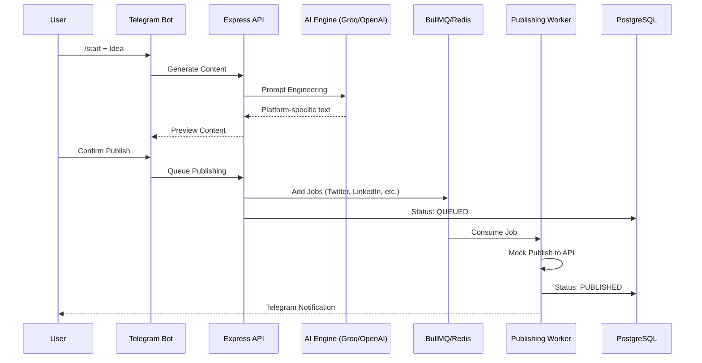

# 🏗️ Postly System Architecture

## Overview
Postly is designed as a distributed system consisting of three main components: an **API Gateway**, a **Telegram Bot Interface**, and an **Asynchronous Publishing Worker**.

## 🧱 Component Breakdown

### 1. API Server (Express.js)
The core RESTful API handles authentication, user profiles, social account management, and content generation requests. It enforces security via JWT and rate-limiting.

### 2. Telegram Bot (Grammy)
Provides an interactive UI for end-users. It uses **Redis-backed sessions** to maintain state during multi-step post creation. It communicates with the backend via webhooks for high performance.

### 3. AI Engine Service
A unified service layer that abstracts multiple AI providers (Groq, OpenAI, Anthropic). It handles prompt engineering, platform-specific constraints (e.g., character limits), and detail level adjustments.

### 4. Background Worker (BullMQ)
When a post is confirmed, the system decomposes it into platform-specific jobs. These are pushed to dedicated Redis queues. The worker processes these jobs with an exponential backoff retry strategy.

## 🔄 Data Flow (End-to-End)

## 🔐 Security Measures
- **Encryption:** All social media access tokens and AI API keys are encrypted at rest using **AES-256-GCM**.
- **Auth:** JWT rotation with refresh tokens stored in the database.
- **Validation:** Strict input validation using **Zod** at the controller level.

## 📦 Database Schema
- `users`: Core profile and preferences.
- `social_accounts`: Encrypted credentials for target platforms.
- `posts`: Master record for a user's original idea and configuration.
- `platform_posts`: Individual records for each platform's generated content and its publishing status.
