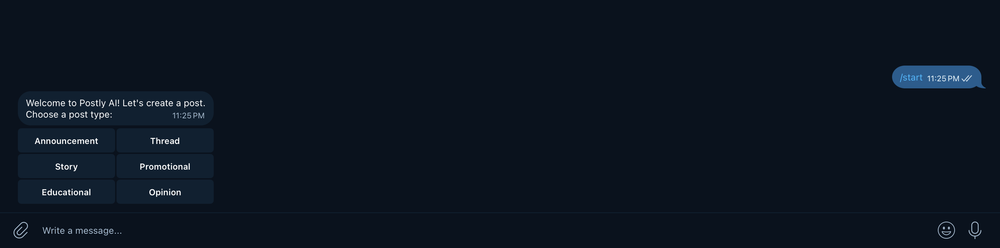
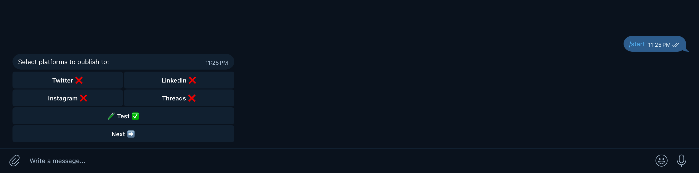
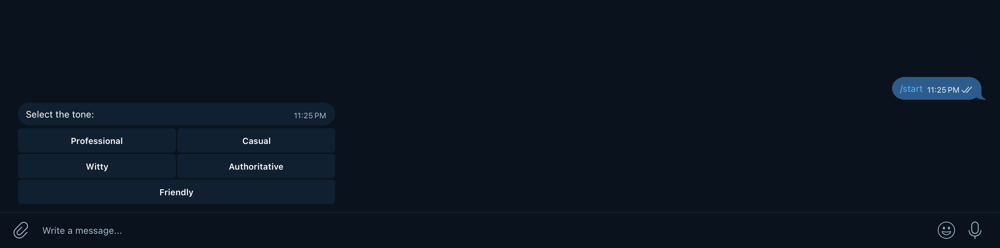
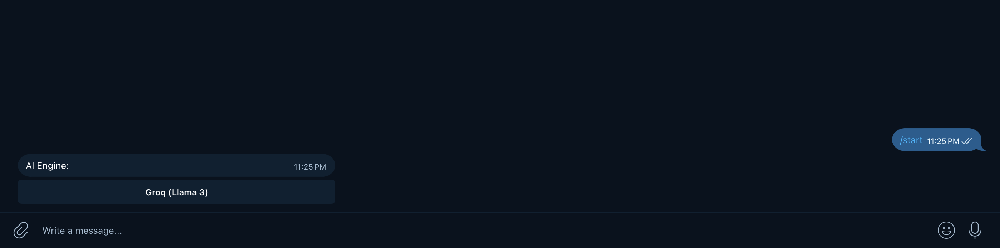
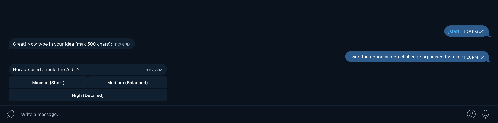
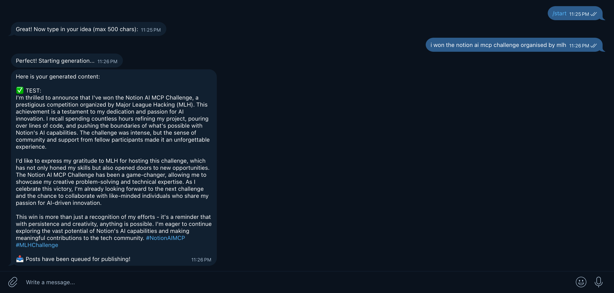
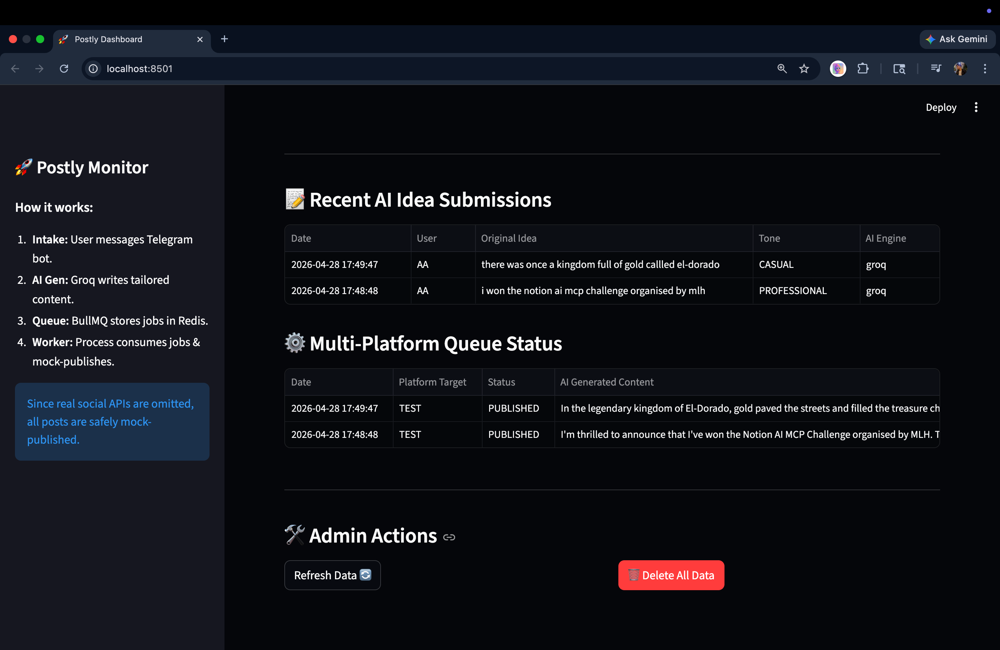

# 🚀 Postly — Multi-Platform AI Content Engine

Welcome to **Postly**, a sophisticated backend engine designed to bridge the gap between a simple idea and a fully-tailored social media presence. Whether you're targeting the fast-paced world of Twitter or the professional landscape of LinkedIn, Postly automates the creative and technical overhead of content publishing.

Built for the **Credes TechLabs Backend Intern Challenge**, this project demonstrates a robust micro-service inspired architecture using Node.js, BullMQ, and multiple AI providers.

---

## ✨ Key Features

- **🎯 Intelligent Tailoring:** Generates platform-specific content (Twitter, LinkedIn, Instagram, Threads) while strictly adhering to character limits, hashtag counts, and tonal requirements.
- **🤖 Triple-AI Integration:** Support for **Groq (Llama 3)** for speed, **OpenAI (GPT-4o)** for creative depth, and **Anthropic (Claude 3.5)** for precision.
- **📱 Telegram Command Center:** A fully interactive bot that guides you from a raw idea to a scheduled post in under 60 seconds.
- **⚙️ Reliable Background Workers:** Uses **BullMQ + Redis** to handle publishing jobs. If an external API is down, the system handles retries automatically with exponential backoff.
- **🔒 Enterprise-Grade Security:** Sensitive API keys and social tokens are never stored in plaintext; they are protected using **AES-256-GCM encryption**.
- **📊 Real-time Dashboard:** A Streamlit-based monitoring tool to track your queue, user growth, and AI generation metrics.

---

## 🛠️ Tech Stack

- **Core:** Node.js (v20) & TypeScript
- **Framework:** Express.js
- **Database:** PostgreSQL with Prisma ORM
- **Queue/Cache:** BullMQ & Redis
- **Bot Engine:** Grammy (Telegram Bot API)
- **Infrastructure:** Docker & Docker Compose
- **Testing:** Jest & Supertest

---

## 🚀 Getting Started

### 1. Clone & Install
```bash
git clone https://github.com/Arya-Akshat/Postly.git
cd Postly
npm install
```

### 2. Environment Setup
Create a `.env` file from the provided example:
```bash
cp .env.example .env
```
Fill in your `GROQ_API_KEY`, `TELEGRAM_BOT_TOKEN`, and `ENCRYPTION_KEY` (a 64-character hex string).

### 3. Launch Infrastructure
Start your database and queue services:
```bash
docker-compose up -d
```

### 4. Initialize Database
```bash
npx prisma db push
```

### 5. Run the Engine
You can use the provided startup script to launch the server, worker, and ngrok tunnel simultaneously:
```bash
chmod +x start.sh
./start.sh
```

---

## 🤖 Bot Interaction Flow

The Telegram bot (`@YourBotHandle`) is the primary interface for Postly:

1.  **/start**: Choose your post type (Announcement, Story, etc.).
2.  **Platform Selection**: Toggle multiple platforms (Twitter, LinkedIn, etc.) using inline buttons.
3.  **Tone & Detail**: Select your brand voice and how detailed the AI should be.
4.  **The Idea**: Type your raw concept (e.g., *"One king one queen both die story end"*).
5.  **Preview & Publish**: Review the AI's drafts and confirm. The system then automatically queues the jobs for publishing.

---

## 📁 Repository Structure

- `src/modules/auth`: JWT-based authentication system with refresh token rotation.
- `src/modules/ai`: The brain of the app, handling prompt engineering and provider switching.
- `src/modules/telegram`: Bot handlers and Redis-based session management.
- `src/modules/queue`: BullMQ definitions and Redis connection logic.
- `src/workers`: Background processes that consume and execute publishing tasks.
- `dashboard.py`: Streamlit application for data visualization.

---

## 🧪 Testing
The project includes a suite of integration tests to ensure API reliability.
```bash
npm test
```

## 📜 Deliverables Included
- ✅ Full Source Code (TypeScript)
- ✅ `ARCHITECTURE.md` with system diagrams
- ✅ `AI_USAGE.md` documenting AI-assisted development
- ✅ Docker Compose for easy deployment
- ✅ Integrated Testing Suite
- ✅ Postman Collection (`postly_api_collection.json`)

---

## ⚠️ Project Limitations & Constraints

Due to **financial constraints** and the **time-intensive nature of API approvals**, this project is provided as a local-first, production-ready architecture rather than a live-hosted service.

### 1. 💰 Deployment & Infrastructure
A live deployment was bypassed because:
- **Infrastructure Costs:** Reliable background processing with BullMQ requires persistent Redis and Database instances. High-performance cloud tiers for these services are beyond the scope of a free-tier project.
- **Service Stability:** Free-tier cloud providers (like Render or Railway) often "sleep" services, which breaks the responsiveness required for a real-time Telegram bot.

### 2. 🔑 API Access & LLM Usage
- **Social Platform Approval:** Real integration with Twitter/LinkedIn requires multi-day developer portal approval and verified credentials.
- **LLM Credit Usage:** Premium AI models (OpenAI/Anthropic) are credit-based. Providing a live URL would risk unmonitored credit exhaustion.
- **Mock-Ready:** The publishing logic is **completely built**. You simply need to provide your own API keys in the `.env` file to trigger real posts.

### 3. ✅ Verification
To ensure full transparency and proof of work, I have provided:
- **Full Video Demo:** [demo.mov](./demo.mov) - Showing the system working end-to-end.
- **One-Command Setup:** Use `docker-compose up` to see the entire stack (Bot, Worker, DB, Redis) run locally in seconds.

---

## 📸 Visual Walkthrough

### Telegram Bot Interface
<div align="center">
  
  
  
</div>





### Real-time Monitoring Dashboard


---
